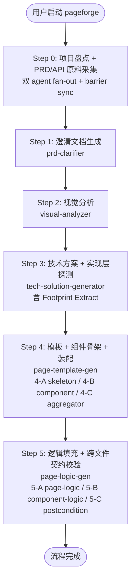
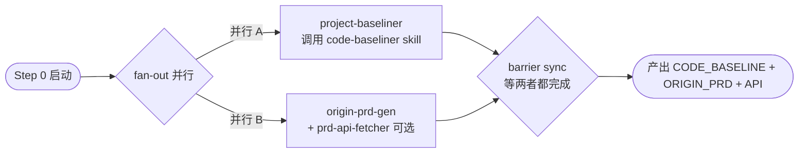
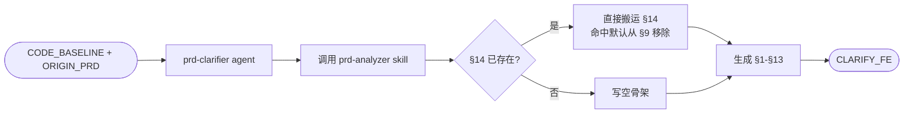
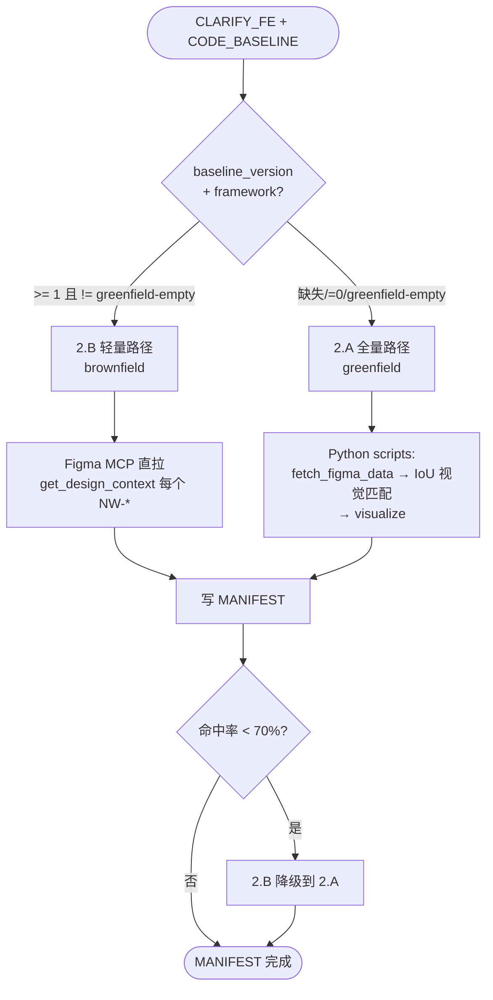
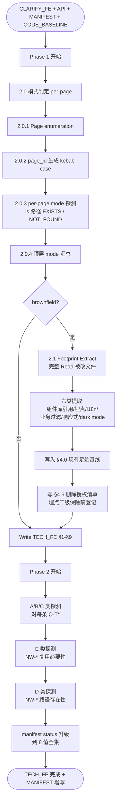
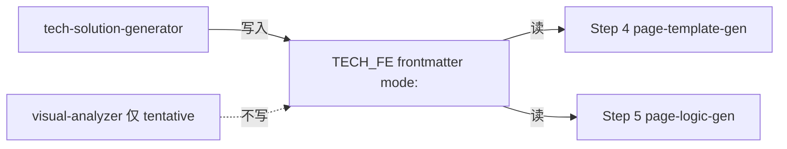
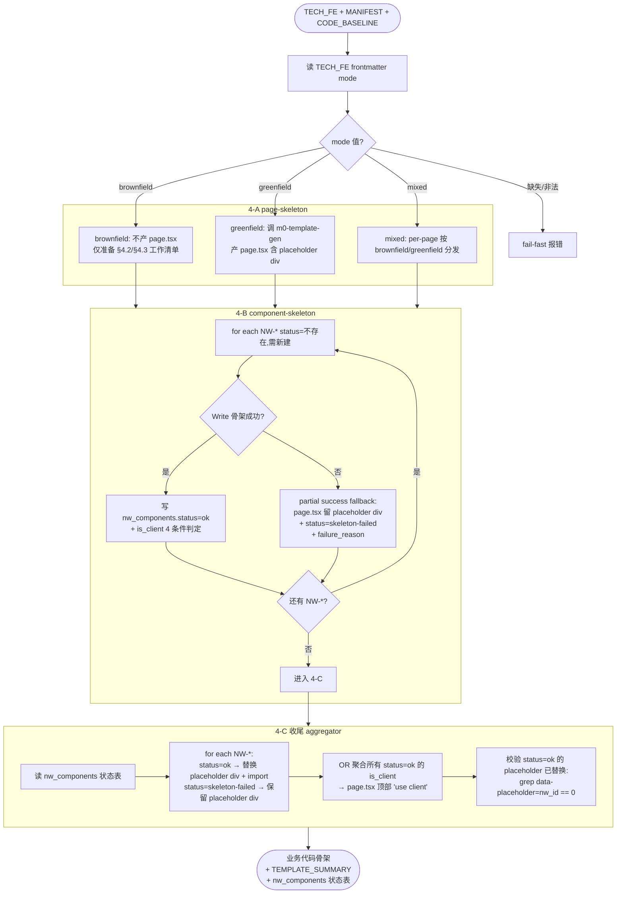
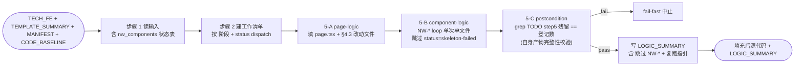
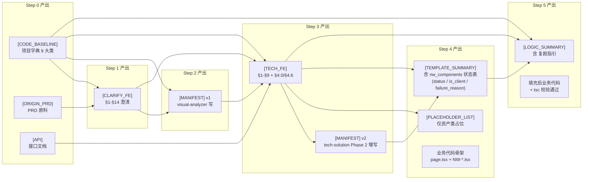
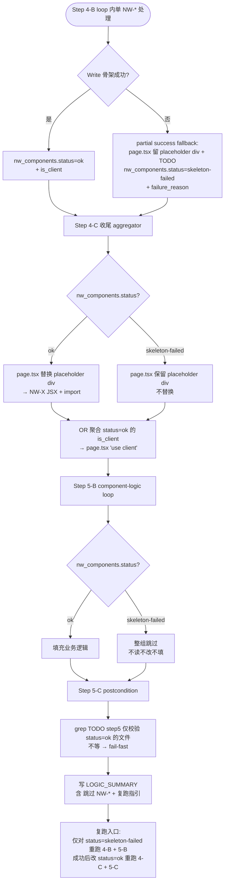

# pageforge 端到端流程图

> 基于 2026-05-03 step 6 删除 + 三阶段切分（4-A/4-B/4-C + 5-A/5-B/5-C）+ partial success 兜底链路落地后的 spec 状态。修订需同步更新，避免与 `skills/pageforge/SKILL.md` 漂移。

---

## 1. 顶层流程（6 step）



> 注：mode 分支（brownfield / greenfield / mixed）在 step 4 内部按 [TECH_FE] frontmatter `模式:` 字段决定，不在顶层流程图分支。原 step 6 已删除——其职责拆给 step 4-C（替换 placeholder + 'use client' OR 聚合）和 step 5-C（跨文件 prop contract 校验）。

---

## 2. Step 0 — 项目盘点 + PRD/API 原料采集

### 调用结构



### 输入 / 输出

| | A 路（project-baseliner） | B 路（origin-prd-gen + prd-api-fetcher）|
|--|---|---|
| **输入** | PROJECT_ROOT 绝对路径 + SCOPE_HINT | 远端 PRD URL / 聊天文本 + Figma 链接 |
| **输出** | `[CODE_BASELINE]` = `.claude/docs/code-baseline.md` | `[ORIGIN_PRD]`、`[API]`（可选）|
| **失败语义**（P1-13）| **fail-fast**：A 失败 → 整 step 0 失败，主 Agent 报错并停 | **best-effort**：[ORIGIN_PRD] 失败 = fail-fast；仅 [API] 失败 = 允许继续，下游 §3 标 absent |
| **重试** | 可恢复错误（socket/network timeout）自动重试 1 次 | 同左 |

### 关键约束

- A 路调用 `code-baseliner` skill 输出 9 大类字段（M1-M9 三态）
- M6.api_style 探测规则（P0-8）：依赖匹配 → trpc / graphql / grpc / rest / mixed
- 增量探测：基于 manifest 的 size + content_hash[:16]
- workflow 全程禁止在 PROJECT_ROOT 内执行 git 命令

---

## 3. Step 1 — 澄清文档生成

### 流程



### 输出结构

| 章节 | 内容 |
|------|------|
| §1-§8 | PRD 解析（需求简介 / 核心逻辑 / 实现范围 / 页面布局 / I-S-D-A 需求列表）|
| §9 | 待确认项 Q-* |
| §10 | 设计稿优先项 O-* |
| §11 | 现有代码定位 C-*（brownfield 必填）|
| §12 | 复用 vs 新建清单 RU-* / NW-*（**表头固化** P1-15）|
| §13 | 影响面评估 IM-* |
| §14 | 项目级澄清默认（**canonical store** P0-5）|

### §12 固化 schema（P1-15）

```
| 编号 | 组件名 | 类别（RU/NW） | 描述 | 计划路径 | 包装组件 |
mixed mode 额外加 page_id 列
```

### §14 canonical 规则（P0-5）

> §14 自身就是项目级偏好的唯一权威，跨 PRD 持续累积；与 [CODE_BASELINE] M9（规则文件路径索引）是两类不同内容，不构成 dual-write。

---

## 4. Step 2 — 视觉分析

### 分支判断



### 关键约束

- Mode 仅 tentative（P0-7b）：visual-analyzer 不写 [TECH_FE]，最终 mode 由 step 3 钉死
- status 字段无 emoji（P0-3）：`复用现有` / `不存在，需新建` / `figma_node_missing` / `待 step 3 确认`
- mixed 场景在本 step 不拆分，按主路径产出全量 manifest，per-page 分发由 step 4/6 消费
- Figma MCP 严格使用 `mcp__claude_ai_Figma__*`，禁止 REST API / 截图

### 产物

`[MANIFEST]` 含每个 NW-*/RU-* 的 `figma_node` / `design_tokens` / `placement` / `status` / `wraps` / `insert_into` / `import_from`。

---

## 5. Step 3 — 技术方案 + 实现层探测（最重）

### 两阶段



### Footprint Extract 六类（brownfield 强制）

| 类别 | 提取方法 |
|------|---------|
| 组件库引用 | grep 来自 [CODE_BASELINE] M4 探测的组件库路径前缀 |
| 埋点调用 | grep 来自 [CODE_BASELINE] M5 探测的埋点 hook 名 |
| i18n key | grep `t\(['"]` 抽 key 字符串 + 共同前缀 |
| 业务过滤逻辑 | useMemo / filter / includes / startsWith 回调体 |
| 响应式策略 | CSS-breakpoint vs JS-detect hook |
| 暗色模式 | 按 [CODE_BASELINE] 探测的 dark mode 模式 grep |

### §4.6 删除授权规则

- §4.0 列出但 §4.6 未登记的足迹 → step 4/5 必须保留
- §4.6 必须引用 [CLARIFY_FE] 段号作为授权依据
- **埋点二级保险**：埋点类禁止登记 §4.6（即使 PRD 说改也走加法）

### Mode 单源（P0-7b）



---

## 6. Step 4 — 模板 + 组件骨架 + 装配（三时间阶段 4-A/4-B/4-C × mode 分支正交）

### 三阶段流程



### Status fail-fast（P0-4）

```
读 [MANIFEST] 每个组件 status：
- 不存在，需新建      → 4-B 产骨架
- 内联复用            → 不新建文件，按 inline_usage 在调用方内联
- 复用现有/已有可复用  → 直接 import_from
- 已有需改造/同功能已有 → 评估
- figma_node_missing  → 跳过 design token，用 §5 方案
- 待 step 3 确认      → fail-fast（upstream Phase 2 未完成）
- 其他未知值          → fail-fast（status 不在受控集合）
```

### 关键约束

- **Mode single source**：仅读 [TECH_FE] frontmatter，禁止回退 [CODE_BASELINE]（P0-7b + P1-13）
- **§4.0 / §4.6 必读**：未登记足迹必须保留（P0-2）
- **strict equality only**：先查 [CODE_BASELINE] M3 token 表，命中用 token，未命中 fallback arbitrary value（P0-1）
- **i18n add-only**：只新增 key，不改既有 key
- **4-B 单次单文件 loop**：禁止单次产多个 NW-*（避免 token 爆 + partial success 隔离）
- **4-B partial success fallback**：单 NW-* 失败 → status=skeleton-failed，**不抛主流程**，下一个 NW-* 继续
- **'use client' 4 条件判定**：每个 NW-* 在 4-B 判定 is_client，4-C OR 聚合到 page.tsx

---

## 7. Step 5 — 逻辑填充（5-A/5-B/5-C 三阶段）

### 三阶段流程



### 5 类 TODO 标签

| 标签 | 含义 | 处理 |
|------|------|------|
| TODO step5 | 模板留下的待填占位 | 步骤 3 填充 |
| C 类（dev server 实测）| 运行时观察才能定 | 留 `// TODO step5: 留 dev server 实测` |
| upstream-gap | atom 缺写入端等跨文件依赖 | 留 `// TODO upstream-gap: ...` |
| step5-pending | §5 未覆盖的待决 | 留 `// TODO step5-pending: ...` |
| i18n-gap | 缺 key 但 step 4 未补 | 步骤 3 加 key 到 en.json |

### 关键约束

- §4.0 / §4.6 必读，足迹保留（埋点 / 业务过滤 / 响应式策略 / dark mode）
- 不引入 §5 未提及的 hook / atom / 副作用
- 5-A 阶段处理 page.tsx + §4.3 改动文件
- 5-B 阶段按 NW-* loop 单次单文件，**status=skeleton-failed 整组跳过**（不读不改不填）
- 5-C 唯一关 grep TODO step5 残留 ≠ 预期 → fail-fast
- **pageforge 单一职责 = 生码**：typecheck / lint / baseline diff / 静态分析等是项目级 CI / pre-commit 的职责，不入 5-C

---

## 9. 文档契约关系图



---

## 10. [MANIFEST] status 受控集合（8 值 + Producer ownership）

> 来源 pageforge/SKILL.md §[MANIFEST] status 受控集合（P0-4）

| status 值 | 含义 | Producer | 写入时机 |
|-----------|------|---------|---------|
| `不存在，需新建` | 组件不存在，需新建独立文件 | visual-analyzer | step 2 阶段 4 |
| `复用现有` | 直接 import 现有组件，零改动 | visual-analyzer | step 2 阶段 4 |
| `figma_node_missing` | Figma 命中失败，跳过 token 提取 | visual-analyzer | step 2 阶段 4 |
| `待 step 3 确认` | 中间态，必须由 Phase 2 升级 | visual-analyzer | step 2（仅中间态）|
| `内联复用` | 不新建独立文件，按 inline_usage 内联 | tech-solution-generator | step 3 Phase 2（E 类）|
| `已有可复用` | 路径已存在且可直接复用 | tech-solution-generator | step 3 Phase 2（D 类）|
| `已有需改造` | 路径已存在但需修改 | tech-solution-generator | step 3 Phase 2（D 类）|
| `同功能已有` | 路径不存在但找到同功能文件 | tech-solution-generator | step 3 Phase 2（D 类）|

**Lifecycle invariant**：
- step 3 Phase 2 完成后禁止残留 `待 step 3 确认`
- step 4/5 消费方遇 `待 step 3 确认` 或未知 status → fail-fast

---

## 11. 模式分类与触发表

| 全部页面情况 | 顶层 `模式:` | 输出 `pages:` | step 4-A 路径 | step 4-B/4-C |
|------------|------------|--------------|---------------|-------------|
| 全部 brownfield | `brownfield` | 否 | 4.1 改造（外科手术 §4.3）| 4-B 产 NW-* 骨架；4-C 在 §4.3 改既有文件时注入 NW-* import |
| 全部 greenfield | `greenfield` | 否 | 4.2 新建（m0-template-gen 产 page.tsx + placeholder div）| 4-B 产 NW-* 骨架；4-C 替换 page.tsx placeholder + 'use client' OR 聚合 |
| 页数 ≥ 2 且混合 | `mixed` | 是 | 4.M 混合（per-page 分发）| 4-B 按 page_id 分组 loop；4-C 各 page 独立处理 |

`mixed` 严格定义：**页数 ≥ 2 且既有 brownfield 又有 greenfield 才允许**。

**注**：4-A/4-B/4-C 三阶段是时间阶段，与 mode 分支正交。每个 mode 都跑全部三阶段，只是各阶段动作不同。

---

## 12. 硬规则汇总（来自 P0/P1 修复）

### 全局
- Workflow 严禁在 PROJECT_ROOT 执行 git 命令
- skill / agent 内部禁止 hardcode 项目特定资产名（如 `CoUI`、`useScreenTypeStore`、`interest_tag_*`）
- 所有 status / mode 字面量是受控集合，emoji 禁止出现在数据值里
- i18n add-only

### Step 0
- A 路 fail-fast，B 路 best-effort（仅 [API] 失败允许继续）
- 可恢复错误重试 1 次

### Step 2
- 2.A vs 2.B 分支基于 baseline_version
- mode 仅 tentative，不写 [TECH_FE]

### Step 3
- brownfield 强制做 Footprint Extract → §4.0 + §4.6
- §4.0 列出但 §4.6 未登记的足迹 → 下游必须保留
- 埋点二级保险（§4.6 不允许登记埋点删除）
- mode 钉死 [TECH_FE] frontmatter，单一权威

### Step 4
- mode 仅读 [TECH_FE] frontmatter，禁止回退
- status 不在受控集合 → fail-fast
- strict equality token lookup（先查 M3，未命中 fallback arbitrary）
- 4-B 单次单文件 loop（禁止单次产多个 NW-*）
- 'use client' 4 条件判定每个 NW-* 独立判定，4-C OR 聚合到 page.tsx
- partial success fallback：4-B 单 NW-* 失败 → status=skeleton-failed，**不抛主流程**
- 4-C 替换 page.tsx placeholder 仅对 status=ok 的；status=skeleton-failed 保留 placeholder div

### Step 5
- Postcondition（P1-16）：grep TODO step5 残留 == 预期，否则 fail-fast
- 不引入 §5 未提及的 hook / atom / 副作用
- 5-B 单次单文件 loop，status=skeleton-failed 整组跳过
- **pageforge 单一职责 = 生码**：typecheck / lint / baseline diff 等是项目级 CI 职责，不入 5-C

---

## 13. 各 step 估时（基于 onlychat 实测，step 6 删除后估算）

| Step | 时长 | 占比 | 主要瓶颈 |
|------|-----|------|---------|
| Step 0 | 8-12 min | ~25% | code-baseliner 全 scan 项目 + Figma MCP |
| Step 1 | 5-8 min | ~15% | prd-clarifier 写 §1-§14 |
| Step 2 | 10-15 min | ~25% | Figma MCP 调用 N 个 NW-* 节点（最重）|
| Step 3 | 8-12 min | ~20% | Footprint Extract 完整 Read + Phase 2 探测 |
| Step 4 | 8-12 min | ~15% | 4-A page-skeleton + 4-B NW-* loop（每个 ~1 min）+ 4-C 收尾 |
| Step 5 | 6-10 min | ~10% | 5-A + 5-B NW-* loop + 5-C tsc 校验（首次 ~30s-2 min）|

总时长：**~45-69 min**（greenfield 项目 N=4 个 NW-* 时取中位数 ~55 min；brownfield 略短，因为 4-B 仅产骨架不替换 placeholder）。

---

## 14. partial success 兜底链路



**复跑入口**：[LOGIC_SUMMARY] 末尾"复跑指引"段告诉用户怎么手动重跑——只对 nw_components.status=`skeleton-failed` 的 NW-* 重跑 step 4-B + step 5-B，不重跑全流程。重跑成功后改 status=`ok`，再重跑一次 step 4-C 收尾 + step 5-C postcondition 即可。

### nw_components 状态表 schema（[TEMPLATE_SUMMARY] 内）

| 字段 | 类型 | Producer | 说明 |
|---|---|---|---|
| `nw_id` | string | step 4-B | 来自 [TECH_FE] §4 表格 NW-* 编号 |
| `path` | string | step 4-B | NW-*.tsx 绝对路径 |
| `status` | enum | step 4-B | `ok` / `skeleton-failed` |
| `is_client` | bool | step 4-B | 'use client' 4 条件判定结果 |
| `failure_reason` | string? | step 4-B | status=`skeleton-failed` 时填，一行 |
| `page_id` | string? | step 4-B | 仅 mixed 模式必填 |

---

## 15. 引用与同步

- 主 spec：`.claude/skills/pageforge/SKILL.md`
- Step 子 agent：`.claude/agents/{project-baseliner,prd-clarifier,visual-analyzer,tech-solution-generator,page-template-gen,page-logic-gen}.md`
- 复用 skill：`.claude/skills/{code-baseliner,origin-prd-gen,prd-analyzer,figma-analyzer,api-doc-gen,m0-template-gen,get-background-img}/SKILL.md`（com-code-gen 已删除）
- 演进记录：`agg/evolution/`（按日期归档）

**最后更新**：2026-05-03（step 6 删除 + 三阶段切分 + partial success 兜底链路落地）
